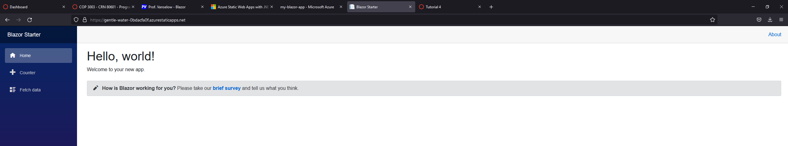

# Welcome to my Blazor App!
# What is Blazor?
Blazor is a free and open-source web framework developed my Microsoft for developers to create web apps using C# and HTML.
# Link to website
[https://gentle-water-0bdacfa0f.azurestaticapps.net](https://gentle-water-0bdacfa0f.azurestaticapps.net/)

## Tutorials followed
Starting Blazor Tutorial: https://dotnet.microsoft.com/learn/aspnet/blazor-tutorial/intro

Azure Tutorial: https://devblogs.microsoft.com/aspnet/azure-static-web-apps-with-blazor/

Todo Tutorial: https://docs.microsoft.com/en-us/aspnet/core/tutorials/build-a-blazor-app?view=aspnetcore-5.0&pivots=server
